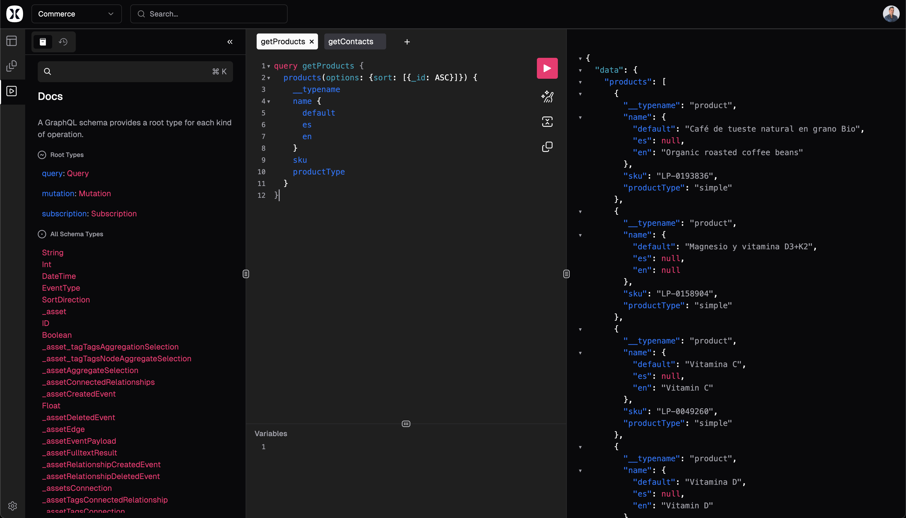

<div align="center">
  <a href="https://flexkit.io">
    <picture>
      <source media="(prefers-color-scheme: dark)" srcset="https://flexkit.io/public/logos/icon-dark-background.png">
      
    </picture>
  </a>
  <h1>Flexkit Explorer</h1>

<a href="https://www.npmjs.com/package/@flexkit/explorer"></a>
<a href="https://github.com/flexkit-io/flexkit/blob/main/LICENSE"></a>
<a href="https://github.com/orgs/flexkit-io/discussions"></a>

</div>

**Explorer is a plugin for Flexkit Studio that provides a graphical interactive in-browser GraphQL IDE where you can explore and test the GraphQL API of your Flexkit project.**

## Features

- Full language support of the latest
  [GraphQL Specification](https://spec.graphql.org/draft/#sec-Language):
- Syntax highlighting
- Intelligent type ahead of fields, arguments, types, and more
- Real-time error highlighting and reporting for queries and variables
- Automatic query and variables completion
- Automatic leaf node insertion for non-scalar fields
- Documentation explorer with search and markdown support
- Persisted state using `localStorage`



## Installation

```shell
npm install @flexkit/explorer
```

### Configuring

```ts
// `flexkit.config.ts`:
import { defineConfig } from '@flexkit/studio/ssr';
import { Explorer } from '@flexkit/explorer';

export default defineConfig({
  plugins: [Explorer()],
});
```

## Contributing

Contributions to Flexkit are welcome and highly appreciated. However, before you jump right into it, we would like you to review our [Contribution Guidelines](/contributing.md) to make sure you have a smooth experience contributing to Flexkit.

## Reporting Issues

Found a bug? Have a feature request?

Open an issue with:
• Repro steps
• Expected vs actual behavior
• Screenshots when helpful
• Schema snippet (if relevant)

## License

This project is licensed under the **MIT license**.

See [LICENSE](https://github.com/flexkit-io/flexkit/blob/main/LICENSE) for more information.

---

## Security

If you believe you have found a security vulnerability in Flexkit, we encourage you to **_responsibly disclose this and NOT open a public issue_**.

Please email us at security@flexkit.io to report any security vulnerabilities.
